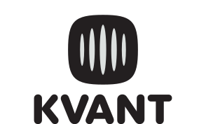

<div align="center">
  <picture>
    <source media="(prefers-color-scheme: dark)" srcset="./assets/header.dark.svg">
    
  </picture>
</div>

<br>

<p align="center">
  Universal, type-safe state manager for&nbsp;<b>key&#8209;value&nbsp;interfaces</b>:
  <br>
  URL&nbsp;search&nbsp;params, cookies, <code>localStorage</code>, <code>sessionStorage</code>,
  and&nbsp;more.
</p>

<p align="center">
  <a href="https://www.npmjs.com/package/kvantjs"><picture><source media="(prefers-color-scheme: dark)" srcset="https://www.shieldcn.dev/npm/kvantjs.svg?variant=default&amp;size=xs&amp;mode=dark&amp;theme=red"></picture></a>
  <a href="https://npmgraph.js.org/?q=kvantjs"><picture><source media="(prefers-color-scheme: dark)" srcset="https://shieldcn.dev/badge/dependencies-0.svg?variant=default&amp;size=xs&amp;theme=green&amp;logo=ri%3APiTree&amp;mode=dark"></picture></a>
  <a href="https://bundlephobia.com/package/kvantjs"><picture><source media="(prefers-color-scheme: dark)" srcset="https://shieldcn.dev/bundlephobia/minzip/kvantjs.svg?variant=default&amp;size=xs&amp;theme=blue&amp;mode=dark"></picture></a>
</p>

## Installation

Install kvant with your package manager of choice:

```bash
npm install kvantjs
```
```bash
pnpm add kvantjs
```
```bash
yarn add kvantjs
```
```bash
bun add kvantjs
```

## Documentation

Read the **complete documentation** for your framework of choice:

- <a href="https://kvantjs.dev/docs/react"> React</a>
- <a href="https://kvantjs.dev/docs/next"> Next.js (app router)</a>
- <a href="https://kvantjs.dev/docs/next-pages"> Next.js (pages router)</a>
- <a href="https://kvantjs.dev/docs/react-router"> React Router</a>
- <a href="https://kvantjs.dev/docs/vue"> Vue</a>
- <a href="https://kvantjs.dev/docs/vue-router"> Vue Router</a>
- <a href="https://kvantjs.dev/docs/nuxt"> Nuxt</a>

## Quick Start

> [!TIP]
> Below you'll find a quick start guide based on *Next.js (app router)*.
> 
> For complete docs on Next.js and other frameworks, please see the [options](#documentation) above.

kvant turns key-value interfaces into React state. Bind a key, pass a
schema from [`kvantjs/schema`](https://kvantjs.dev/docs/next/schema), and read/write it like `useState`.
The interface (here, the URL) stays the single source of truth:

```tsx
import { useSearchParams } from 'kvantjs/next'
import * as kv from 'kvantjs/schema'

function SearchInput() {
  const [query, setQuery] = useSearchParams('q', kv.string().default(''))

  return (
    <input
      value={query}
      onChange={e => setQuery(e.target.value)}
    />
  )
}
```

`?q=hello` in the URL means `query` is `'hello'`. Calling `setQuery` writes back to the URL.

### Multiple keys

Bind a whole key map in one call. Updates batch into a single write:

```ts
const [filters, setFilters] = useSearchParams({
  q: kv.string().default(''),
  page: kv.index().default(0),
  sort: kv.enum(['asc', 'desc']).default('asc'),
  tags: kv.array(kv.string()).default([]), // repeated params: ?tags=a&tags=b
})

setFilters(prev => ({ ...prev, page: prev.page + 1 }))
```

### Options

Pass options as the last argument:

```ts
const [query, setQuery] = useSearchParams('q', kv.string().default(''), {
  history: 'push', // add browser history entries
  shallow: false, // go through the Next.js router (re-run server components)
})
```

### Global default options

Set options once for a component subtree using the **options provider**:

```tsx
import { SearchParamsOptionsProvider } from 'kvantjs/next'

<SearchParamsOptionsProvider defaultOptions={{ history: 'push' }}>
  {children}
</SearchParamsOptionsProvider>
```

### Every interface

The same pattern works for all supported key-value interfaces:

```ts
import { useSearchParams } from 'kvantjs/next'
import { useCookies, useLocalStorage, useSessionStorage } from 'kvantjs/react'
import * as kv from 'kvantjs/schema'

// URL search params: shareable, bookmarkable
const [query, setQuery] = useSearchParams('q', kv.string().default(''))

// localStorage: persists across reloads, syncs across tabs
const [theme, setTheme] = useLocalStorage('theme', kv.enum(['light', 'dark']).default('light'))

// sessionStorage: scoped to the current tab
const [draft, setDraft] = useSessionStorage('draft', kv.string().default(''))

// Cookies: readable by the server, respect Set-Cookie attributes
// (requires additional setup for SSR, see the full guide)
const [consent, setConsent] = useCookies(
  'consent',
  kv.stringbool().default(false),
  { maxAge: 60 * 60 * 24 * 365 },
)
```

Full guides:
[Search Params](https://kvantjs.dev/docs/next/search-params) ·
[Local Storage](https://kvantjs.dev/docs/next/local-storage) ·
[Cookies](https://kvantjs.dev/docs/next/cookies)

## Special Thanks

- [**nuqs**](https://github.com/47ng/nuqs) 🖤 played a marginal role in inspiring the kvant API,
  as well as providing bits and pieces of code for the kvant internals.
- kvant API is shaped around [**zod**](https://github.com/colinhacks/zod) 💙 as [`kvantjs/schema`](https://kvantjs.dev/docs/next/schema)
  builds on your existing Zod intuition, so defining schemas feels just like writing plain Zod.

## License

MIT License © [Oleg Kapranov](https://github.com/okdevme)
